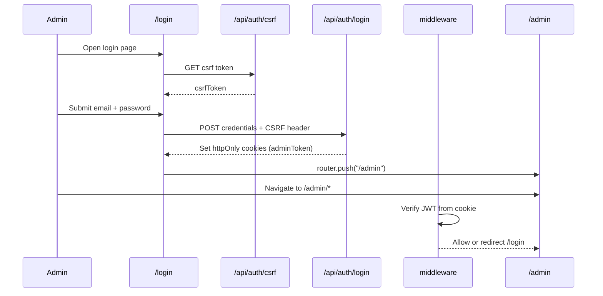

# Memorra Admin Panel — Flow & Functionality

Complete reference for how the admin panel works today: navigation, business flows, module behavior, data status, and planned integrations.

**App location:** `memorra-adminpanel/`  
**Dev URL:** `http://localhost:3000`  
**Admin base path:** `/admin`

---

## Table of contents

1. [Architecture overview](#1-architecture-overview)
2. [Authentication & access flow](#2-authentication--access-flow)
3. [Shell UI (layout, navigation, loaders)](#3-shell-ui-layout-navigation-loaders)
4. [Subscription business model](#4-subscription-business-model)
5. [Module reference (every page)](#5-module-reference-every-page)
6. [Admin user journeys](#6-admin-user-journeys)
7. [Roles & permissions](#7-roles--permissions)
8. [Data layer status](#8-data-layer-status)
9. [API & database mapping](#9-api--database-mapping)
10. [Future revenue & roadmap](#10-future-revenue--roadmap)

---

## 1. Architecture overview

The Memorra admin panel is a **Next.js 16** application that hosts both:

| Layer | Path | Purpose |
|-------|------|---------|
| Admin UI | `/admin/*` | Dashboard, CMS, moderation, settings |
| Admin auth | `/api/auth/*` | Cookie-based JWT login for browser |
| Mobile API | `/api/v1/*` | REST API for Expo mobile app (mostly stubs) |
| Database | Prisma + PostgreSQL | Shared schema for mobile + admin |
| Cache / rate limit | Redis | Login rate limiting, health checks |

```
┌─────────────────────────────────────────────────────────────┐
│                     memorra-adminpanel                       │
├──────────────────┬──────────────────┬─────────────────────┤
│   /login         │   /admin/*       │   /api/v1/*         │
│   Public auth    │   Protected UI   │   Mobile + services │
├──────────────────┴──────────────────┴─────────────────────┤
│  middleware.ts → JWT cookie check → security headers        │
├─────────────────────────────────────────────────────────────┤
│  prisma/schema.prisma  │  lib/redis  │  lib/security.ts    │
└─────────────────────────────────────────────────────────────┘
                              │
                    Memora-mobile-v2 (Expo)
```

**Key files:**

| File | Role |
|------|------|
| `app/admin/layout.tsx` | Wraps all admin pages in `AdminLayout` |
| `src/components/shared/AdminLayout.tsx` | Sidebar, header, loaders, toasts |
| `middleware.ts` | Protects `/admin`, CORS for `/api/v1` |
| `app/login/page.tsx` | Admin sign-in with CSRF |
| `prisma/schema.prisma` | Full data model (~45 models) |

---

## 2. Authentication & access flow

### Login flow



### Steps (current behavior)

1. User visits `/` → redirects to `/admin` (middleware sends unauthenticated users to `/login`).
2. Login page fetches CSRF token from `GET /api/auth/csrf`.
3. On submit, `POST /api/auth/login` with `X-CSRF-Token` header and credentials.
4. Server sets **httpOnly** cookies (`adminToken`, `adminRefreshToken`).
5. `middleware.ts` checks every `/admin/*` request for a valid JWT.
6. Invalid or missing token → redirect to `/login?redirect=/admin/...`.

### Demo credentials (development only)

| Role | Email | Password |
|------|-------|----------|
| Super Admin | `admin@memorra.local` | `SecurePassword123!@#` |
| Admin | `admin2@memorra.local` | `AdminPass123!@#` |
| Moderator | `moderator@memorra.local` | `ModeratorPass123!@#` |
| Finance | `finance@memorra.local` | `FinancePass123!@#` |
| Support | `support@memorra.local` | `SupportPass123!@#` |

### Logout

- `POST /api/auth/logout` clears cookies.
- Client auth context (`lib/auth-context.tsx`) handles session refresh via `/api/auth/refresh`.

---

## 3. Shell UI (layout, navigation, loaders)

### Layout structure

```
┌────────────┬──────────────────────────────────────────┐
│  Sidebar   │  Header (menu, theme toggle, title)       │
│  (nav)     ├──────────────────────────────────────────┤
│            │  Main content (page-specific)            │
│            │  + AdminRouteProgress on route change    │
└────────────┴──────────────────────────────────────────┘
```

### Sidebar navigation (active items)

Defined in `AdminLayout.tsx` → `defaultNavItems`:

| Label | Route | Notes |
|-------|-------|-------|
| Dashboard | `/admin` | Subscription & growth metrics |
| User Management | `/admin/users` | List + detail `/admin/users/[id]` |
| User Posts | `/admin/posts` | Content moderation (badge: 12) |
| Casket Design | `/admin/casket-design` | Templates, colors, submissions, orders |
| Funeral Homes | `/admin/funeral-homes` | Homes + cemeteries tabs |
| Obituaries | `/admin/obituaries` | Memorial notices CMS |
| Video Messages | `/admin/video-messages` | User tribute videos |
| Funeral Music | `/admin/funeral-music` | Catalog + AI suggestions |
| Cremation Urns | `/admin/cremation-urns` | Urn catalog |
| Messages | `/admin/messages` | User conversations |
| Trusted Contacts | `/admin/trusted-contacts` | Legacy contacts |
| Legal Documents | `/admin/legal` | Terms, policies |
| Digital Legacy | `/admin/contents` | Legacy assets (badge: 3) |
| FAQs | `/admin/faqs` | Help center |
| Feedback | `/admin/feedback` | User feedback inbox |
| Safety & Reports | `/admin/reports` | Moderation queue + `/admin/reports/[id]` |
| Settings | `/admin/settings/*` | General, Security, Integrations, Safety |

**Commented out in nav (pages exist but hidden):** Products, Funeral Plans, Cascade Design.

### Loaders

| Component | When it shows |
|-----------|----------------|
| `AdminLoader` (fullscreen) | First mount before theme hydrates |
| `app/admin/loading.tsx` | Next.js route transition under `/admin` |
| `AdminRouteProgress` | Brief overlay on client-side nav between admin routes |
| `Suspense` fallback | Async child boundaries in layout |

### Theme

- Light / dark via `lib/theme-context.tsx` (persisted in `localStorage`).
- Toasts (`react-hot-toast`) follow active theme.

---

## 4. Subscription business model

Memorra’s **primary revenue** is a single monthly subscription. The admin UI is aligned to this model on the dashboard and users pages.

### Product rules (business)

| Rule | Detail |
|------|--------|
| App download | **Free** — users can explore the app |
| Full features | **$8.99/month** subscription required |
| Wishlist | Users can build a wishlist; **saving** requires subscription |
| AI funeral/wake video | **~8 second preview** for free users; full video requires subscription |
| Cancellation | Anytime; **all saved content permanently deleted** on cancel (wishlists, videos, documents, etc.) |
| Future revenue | Vendor ads, insurance referrals, premium AI partnerships |

### Admin representation today

| UI area | What it shows |
|---------|----------------|
| Dashboard | Total users, active subscribers, est. MRR (`subscribers × $8.99`), Free vs Premium chart |
| Users list | Plan chips: **Basic (Free)** vs **Premium ($8.99/mo)** |
| User detail | Plan card with billing cycle (mock) — needs subscription API wiring |
| Prisma `User.plan` | Enum: `BASIC` \| `PREMIUM` |

### Planned admin modules (not built yet)

- **Subscriptions** overview page (`/admin/subscriptions`)
- **Gating rules** settings (preview seconds, save gates, deletion policy)
- **Billing events** log (Stripe webhooks)
- **Cancel & purge** action with deletion preview

---

## 5. Module reference (every page)

Legend: **UI** = interface implemented | **API** = backed by live API | **Mock** = local state / sample data

### Dashboard — `/admin`

**Purpose:** Executive view of users, subscribers, and revenue.

| Feature | Status |
|---------|--------|
| KPI cards (users, subscribers, messages, MRR) | UI + Mock |
| User status pie chart | UI + Mock |
| Plans purchased today (Free vs Premium) | UI + Mock |
| Animated counters | UI |

**Primary audience:** Super Admin, Finance, Admin.

---

### User Management — `/admin/users`

**Purpose:** CRUD and overview of mobile app users.

| Feature | Status |
|---------|--------|
| Search by name/email | UI |
| Add / edit user modal | UI + Mock |
| Delete user | UI + Mock (local state) |
| Plan filter display (Basic / Premium) | UI |
| Summary stats (total, active, premium) | UI |
| Link to user detail | UI |

**User detail — `/admin/users/[id]`**

| Feature | Status |
|---------|--------|
| Profile card (email, phone, location) | UI + Mock |
| Account statistics (memorials, documents, storage) | UI + Mock |
| Current plan card ($/month, features, renew date) | UI + Mock |
| Actions: Modify plan, Send message, Suspend | UI (buttons only) |

**Maps to Prisma:** `User`, `MemorialWishlist`, `DigitalLegacyAsset`, etc.

---

### User Posts — `/admin/posts`

**Purpose:** Moderate social feed content.

| Feature | Status |
|---------|--------|
| Post grid with images | UI + Mock |
| Filter by status (approved, pending, hidden) | UI |
| View detail modal | UI |
| Approve / hide / delete | UI + Mock |
| Stats (total, pending, flagged) | UI |

**Maps to Prisma:** `Post`, `PostMedia`, `ContentStatus`.

---

### Casket Design — `/admin/casket-design`

**Purpose:** Manage casket catalog and manufacturing workflow.

**Tabs:**

| Tab | Features | Status |
|-----|----------|--------|
| Templates | Add/edit modal, material, price, image URL, customizable areas (front/sides/back/head), active/inactive, search | UI + Mock |
| Colors | Add/edit modal, hex picker, category, finish, activate/deactivate, search | UI + Mock |
| Submissions | User design submissions, approve/reject | UI + Mock |
| Orders | Manufacturing orders, status tracking | UI + Mock |

**Maps to Prisma:** `CasketDesign` (templates); submissions/orders may need extended models.

---

### Funeral Homes — `/admin/funeral-homes`

**Purpose:** Directory of funeral homes and cemeteries for the memorial wishlist flow.

| Tab | Features | Status |
|-----|----------|--------|
| Funeral Homes | CRUD modal, address, services, hours, verified flag, state filter, search | UI + Mock |
| Cemeteries | Same pattern for cemetery listings | UI + Mock |

**Maps to Prisma:** `FuneralHome`, `Cemetery`.

---

### Obituaries — `/admin/obituaries`

**Purpose:** Create and publish memorial notices shown in the mobile app.

| Feature | Status |
|---------|--------|
| Stats (total, published, draft, views) | UI |
| Search + status filter | UI |
| Add / edit modal | UI |
| Fields: deceased name, DOB/DOD, author, **title**, **message**, status, featured | UI |
| Publish / archive / feature toggles | UI + Mock |
| Content preview on cards | UI |

**Mobile mapping:** Title + message display on `Memora-mobile-v2/app/funeral/obituary.tsx`.

**Maps to Prisma:** `Obituary` (`title`, `content`, `deceasedName`, `status`, `publishedAt`).

---

### Video Messages — `/admin/video-messages`

**Purpose:** Manage user-uploaded tribute videos.

| Feature | Status |
|---------|--------|
| List with uploader, deceased, duration, views | UI + Mock |
| Status: uploaded → processing → ready → archived → hidden | UI |
| Add / edit modal | UI |
| Publish / hide / delete | UI + Mock |

**Subscription tie-in:** Free users get ~8s preview; full playback requires Premium (mobile gate — not wired in admin yet).

**Maps to Prisma:** `VideoMessage`.

---

### Funeral Music — `/admin/funeral-music`

**Purpose:** Curate funeral music catalog and smart suggestions.

| Feature | Status |
|---------|--------|
| Song CRUD (title, artist, category, audio preview) | UI + Mock |
| In-browser audio preview (`/public/audio/funeral-music/*`) | UI |
| Mood & activity tags | UI |
| Featured toggle | UI |
| AI suggestion reorder (drag-style ordering mock) | UI |
| User activity profiles for recommendations | UI + Mock |

**Maps to Prisma:** `FuneralMusic`, `UserFuneralMusic`.

---

### Cremation Urns — `/admin/cremation-urns`

**Purpose:** Urn product catalog for wishlist selection.

| Feature | Status |
|---------|--------|
| Urn cards (material, style, price, image) | UI + Mock |
| Add / edit modal | UI |
| Active/inactive, featured | UI + Mock |
| Search + category filter | UI |

**Maps to Prisma:** `CremationUrn`.

---

### Messages — `/admin/messages`

**Purpose:** View user-to-user conversations (support / moderation).

| Feature | Status |
|---------|--------|
| Conversation list | UI + Mock |
| Unread counts | UI |
| Thread preview | UI |

**Maps to Prisma:** `Conversation`, `Message`.

---

### Trusted Contacts — `/admin/trusted-contacts`

**Purpose:** Oversee users’ designated legacy contacts.

| Feature | Status |
|---------|--------|
| Contact list (owner, contact name, relationship) | UI + Mock |
| Remove contact | UI + Mock |

**Maps to Prisma:** `TrustedContact`.

---

### Legal Documents — `/admin/legal`

**Purpose:** Manage legal copy (terms, privacy, etc.).

| Feature | Status |
|---------|--------|
| Document list with version/type | UI + Mock |
| Add / delete | UI + Mock |

**Maps to Prisma:** `LegalDocument`.

---

### Digital Legacy — `/admin/contents`

**Purpose:** Review user-uploaded legacy assets (photos, videos, documents).

| Feature | Status |
|---------|--------|
| Asset grid | UI + Mock |
| Approve / reject / hide | UI + Mock |
| Filter by type | UI |

**Maps to Prisma:** `DigitalLegacyAsset`.

**Subscription tie-in:** Deleted on subscription cancellation (policy).

---

### FAQs — `/admin/faqs`

**Purpose:** In-app help center content.

| Feature | Status |
|---------|--------|
| Expandable FAQ list | UI + Mock |
| Categories, view/helpful counts | UI |
| Delete | UI + Mock |
| Add FAQ button | UI (not fully wired) |

**Maps to Prisma:** `Faq`.

---

### Feedback — `/admin/feedback`

**Purpose:** User feedback and feature requests inbox.

| Feature | Status |
|---------|--------|
| Feedback list with rating | UI + Mock |
| Mark resolved | UI + Mock |

**Maps to Prisma:** `Feedback`.

---

### Safety & Reports — `/admin/reports`

**Purpose:** Content and user safety moderation queue.

| Feature | Status |
|---------|--------|
| Report list (type, severity, status) | UI + Mock |
| Search | UI |
| Resolve / dismiss | UI + Mock |
| Detail page `/admin/reports/[id]` | UI + Mock |
| Admin notes on detail | UI |

**Maps to Prisma:** `Report`, `AuditLog`.

---

### Settings

#### General — `/admin/settings/general`

| Field | Status |
|-------|--------|
| App name, support email, website | UI + Mock |
| Timezone, currency, maintenance mode | UI + Mock |
| Save (simulated delay + toast) | UI |

#### Security — `/admin/settings/security`

| Feature | Status |
|---------|--------|
| Session timeout, 2FA toggles (UI) | UI + Mock |
| Password policy display | UI |

#### Integrations — `/admin/settings/integrations`

| Feature | Status |
|---------|--------|
| Stripe, email, storage placeholders | UI + Mock |

#### Safety — `/admin/settings/safety`

| Feature | Status |
|---------|--------|
| Auto-moderation rules, keyword filters | UI + Mock |

---

### Hidden / legacy pages (not in sidebar)

| Route | Purpose |
|-------|---------|
| `/admin/products` | Marketplace products |
| `/admin/funeral-plans` | Funeral plan tiers |
| `/admin/cascade-design` | Cascade memorial templates |

---

## 6. Admin user journeys

### Journey A — Onboard a new subscriber (manual, today)

```
Finance opens Users → finds user → Edit → set plan to Premium ($8.99/mo) → Save
(Future: Stripe webhook auto-updates plan)
```

### Journey B — Publish an obituary to mobile

```
Content admin → Obituaries → New Obituary
  → Fill title + message + deceased details
  → Set status Published → Save
(Future: API persists to DB → mobile fetches published list)
```

### Journey C — Update funeral catalog

```
Admin → Funeral Homes / Casket Design / Funeral Music / Urns
  → Add or edit catalog item → Set active
(Future: Mobile wishlist reads from /api/v1/funeral/*)
```

### Journey D — Handle a safety report

```
Moderator → Safety & Reports → Open report
  → Review detail → Update status → Add note
(Optional: ban user via Users)
```

### Journey E — Subscription cancellation (planned)

```
User cancels in mobile app
  → Webhook fires
  → Backend sets plan BASIC + deletes user content
  → Admin sees event in Billing log + user plan downgraded
```

---

## 7. Roles & permissions

Defined in `lib/security.ts` (`AdminRole`, `AdminPermission`).

| Role | Typical use | Key permissions |
|------|-------------|-----------------|
| **Super Admin** | Full platform control | All permissions |
| **Admin** | Day-to-day operations | Users, content, analytics, death verification |
| **Moderator** | Safety & posts | Moderate/delete content, view users |
| **Support** | Help desk | View/edit users, view transactions |
| **Finance** | Revenue & refunds | Transactions, refunds, analytics |

**Note:** UI does not yet hide sidebar items by role — permissions are enforced in API/middleware layer when wired. Use demo logins to test role intent.

---

## 8. Data layer status

| Layer | Status | Notes |
|-------|--------|-------|
| Admin UI pages | ✅ Implemented | 25+ routes |
| Prisma schema | ✅ Defined | `prisma/schema.prisma` |
| Admin page → API | ⚠️ Mostly mock | Local `useState` + mock arrays |
| `/api/v1/*` routes | ⚠️ Stubs | Return 501 via `stubRoute()` |
| Redis | ✅ Wired | Rate limit on login, health check |
| PostgreSQL | ⏳ Needs `DATABASE_URL` | Run `npm run db:migrate` |

### Standard page pattern (current)

Most admin pages follow:

1. `mockData` array in the page file
2. `useState` for list + modals
3. `handleSave` / `handleDelete` update local state
4. `toast.success` / `toast.error` for feedback
5. Framer Motion for animations
6. Dark/light theme via `useTheme()`

### Wiring checklist (per module)

```
[ ] Create service in src/services/
[ ] Create repository using Prisma
[ ] Implement /api/v1/... route handlers
[ ] Replace mock state with fetch() in page
[ ] Add loading/error states (AdminLoader)
[ ] Write AuditLog on destructive actions
```

---

## 9. API & database mapping

### Admin UI → Prisma models (primary)

| Admin page | Prisma model(s) |
|------------|-----------------|
| Users | `User` |
| Posts | `Post`, `Comment`, `PostLike` |
| Casket Design | `CasketDesign` |
| Funeral Homes | `FuneralHome`, `Cemetery` |
| Obituaries | `Obituary`, `ObituaryTemplate` |
| Video Messages | `VideoMessage` |
| Funeral Music | `FuneralMusic` |
| Cremation Urns | `CremationUrn` |
| Messages | `Conversation`, `Message` |
| Trusted Contacts | `TrustedContact` |
| Legal | `LegalDocument` |
| Digital Legacy | `DigitalLegacyAsset` |
| FAQs | `Faq` |
| Feedback | `Feedback` |
| Reports | `Report` |
| Settings | `SystemSetting` (or env/config) |

### API documentation

- [API_BACKEND.md](./API_BACKEND.md) — routes, auth, commands
- [DATABASE_SCHEMA.md](./DATABASE_SCHEMA.md) — full entity list
- [REDIS_SETUP.md](./REDIS_SETUP.md) — cache and rate limiting

---

## 10. Future revenue & roadmap

### Phase 1 (current focus) — Subscription revenue

- [ ] Stripe subscription ($8.99/mo)
- [ ] Mobile paywall: wishlist save, AI video full playback
- [ ] Admin: Subscriptions dashboard, gating settings, cancel → purge job
- [ ] Wire Users + Dashboard to live metrics

### Phase 2 — Content & catalog APIs

- [ ] Connect all funeral catalog pages to Prisma
- [ ] Mobile reads catalog from `/api/v1/funeral/*`
- [ ] Redis cache for catalog endpoints

### Phase 3 — Additional revenue (admin support)

- [ ] **Vendor marketing** — ad slots CMS in admin
- [ ] **Insurance referrals** — partner links + commission tracking (Finance role)
- [ ] **Premium AI services** — usage metering + billing add-ons

### Phase 4 — Trust & compliance

- [ ] Death verification workflow
- [ ] Final message delivery approval
- [ ] Full audit log UI
- [ ] Export / scheduled reports

---

## Quick commands

```bash
cd memorra-adminpanel
npm run dev              # Start UI + API on :3000
npm run db:generate      # Prisma client
npm run db:migrate       # Apply migrations
npm run redis:up         # Local Redis (Docker)
npm run creds            # Show demo admin logins
```

---

## Related docs

| Document | Description |
|----------|-------------|
| [ADMIN_PANEL_QUICK_REFERENCE.md](./ADMIN_PANEL_QUICK_REFERENCE.md) | Module checklist & estimates |
| [API_BACKEND.md](./API_BACKEND.md) | API structure |
| [DATABASE_SCHEMA.md](./DATABASE_SCHEMA.md) | Prisma models |
| [README.md](../README.md) | Setup & demo credentials |

---

*Last updated: June 2026 — reflects current `memorra-adminpanel` codebase.*
