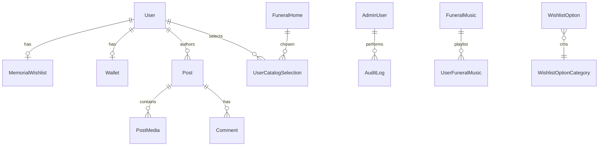

# Memorra database schema

PostgreSQL via Prisma (`prisma/schema.prisma`). Serves **mobile app** and **admin panel**.

## Setup

```bash
cp .env.example .env
# Set DATABASE_URL to your Postgres (Neon recommended)

npm run db:generate
npm run db:migrate
```

## Entity groups

### Admin panel staff
| Model | Purpose |
|-------|---------|
| `AdminUser` | Admin login (separate from mobile users) |
| `AuditLog` | Who changed what |

### Mobile users
| Model | Purpose |
|-------|---------|
| `User` | App accounts, profile, plan (Basic/Premium) |
| `RefreshToken` | Mobile session refresh |
| `Follow` | Social graph |
| `ParentChildLink` | Parent ↔ child account |
| `ChildSafetySettings` | Visibility, posting, discovery rules (JSON) |

### Social feed
| Model | Purpose |
|-------|---------|
| `Post` | Feed posts + moderation (`ContentStatus`) |
| `PostMedia` | Multiple images per post |
| `PostLike` | Likes |
| `Comment` | Comments |
| `Story` | Stories |
| `LiveStream` | Go live / scheduled streams |

### Memorial wishlist
| Model | Purpose |
|-------|---------|
| `WishlistOption` | **Admin CMS** — dropdown options (funeral type, dress code, etc.) |
| `MemorialWishlist` | **User** — core preferences + notes |
| `UserCatalogSelection` | **User** — picks from funeral homes, flowers, urns, etc. |
| `UserFuneralMusic` | **User** — playlist (multiple songs) |

### Funeral catalog (admin CRUD → mobile read)
| Model | Maps to admin page |
|-------|-------------------|
| `FuneralHome` | Funeral Homes |
| `Cemetery` | Funeral Homes (cemeteries tab) |
| `Church` | Church & venue |
| `FlowerArrangement` | Flowers |
| `CasketDesign` | Casket Design |
| `CremationUrn` | Cremation Urns |
| `FuneralMusic` | Funeral Music |
| `ObituaryTemplate` | Obituaries (templates) |
| `Obituary` | User-written obituaries |
| `VideoMessage` | Video Messages |
| `CascadeDesign` | Cascade Design |

### Commerce
| Model | Purpose |
|-------|---------|
| `Product` | Marketplace products |
| `ProductWishlistItem` | Product wishlist (not memorial wishlist) |
| `Wallet` | User balance |
| `WalletTransaction` | Ledger |
| `Gift` | Send gift between users |

### Trust & communication
| Model | Purpose |
|-------|---------|
| `TrustedContact` | Legacy contacts |
| `Conversation` / `Message` | Direct messages |
| `Notification` | Push/in-app notifications |

### Safety & content
| Model | Purpose |
|-------|---------|
| `Report` | Safety reports (links to posts optionally) |
| `Feedback` | User feedback |
| `Faq` | FAQs |
| `LegalDocument` | Terms, privacy, legal |
| `DigitalLegacyAsset` | Digital legacy files |

### CMS / UI control (admin → mobile)
| Model | Purpose |
|-------|---------|
| `AppTheme` | Colors, logos |
| `AppCopy` | Strings by key |
| `FeatureFlag` | Toggle features |
| `AppSetting` | Generic key/value settings |

## API route mapping

| `/api/v1/...` | Primary models |
|---------------|----------------|
| `auth/mobile` | `User`, `RefreshToken` |
| `auth/admin` | `AdminUser` |
| `users` | `User` |
| `posts` | `Post`, `PostMedia`, `Comment`, `PostLike` |
| `stories` | `Story` |
| `live-streams` | `LiveStream` |
| `memorial-wishlist` | `MemorialWishlist`, `UserCatalogSelection` |
| `memorial-wishlist/options` | `WishlistOption` |
| `funeral/*` | Catalog models above |
| `products` | `Product`, `ProductWishlistItem` |
| `wallet` | `Wallet`, `WalletTransaction` |
| `gifts` | `Gift` |
| `trusted-contacts` | `TrustedContact` |
| `messages` | `Conversation`, `Message` |
| `reports` | `Report` |
| `cms/*` | `AppTheme`, `AppCopy`, `FeatureFlag` |
| `settings/*` | `AppSetting` |

## Auth split

- **Mobile users** → `User` table (`/api/v1/auth/mobile/*`)
- **Admin staff** → `AdminUser` table (`/api/auth/*` legacy cookies or `/api/v1/auth/admin/*`)

Do not store admin passwords on `User`.

## Diagram (high level)


